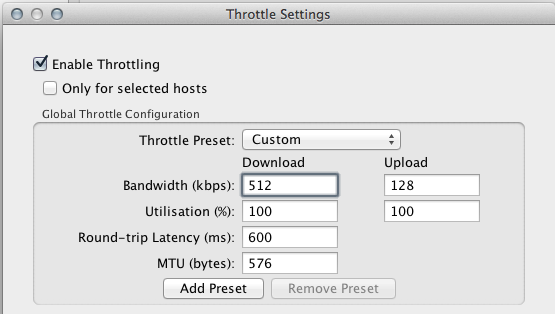
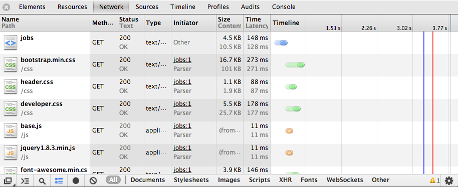
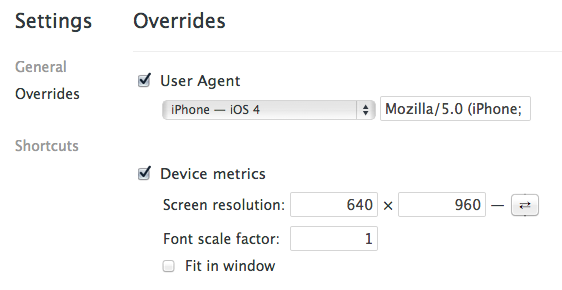

# Strategies for Optimizing Mobile Bandwidth

---

> Exploring some lesser-known techniques for lightening the cargo between server and mobile device

## Internet like it's 1999
June 28, 2007 was a good day to be a web developer. The promise of ubiquitous "high speed" internet was almost a reality, at least in many markets. [Charlie](http://www.youtube.com/watch?v=_OBlgSz8sSM) had just gone viral. Our attention shifted from uglifying compressed progressive jpegs to the possibilities of streaming HD video.

The next day, the first iPhone was released. That, as Apple simply put it, changed everything.

Today, 4G LTE can provide some impressive speeds. But if you're like me, and every smartphone owner I know, and every commenter on the Internet, full-bar 4G heaven is not a permanent residence.

So you went with a native iOS app to get the most performance, and now a spotty 3G connection is your bottleneck. How can you speed things up a bit and make your app feel faster? Let's look at some techniques for those low-bandwidth situations where every KB matters. These fall within three strategies: _make fewer network calls, make them smaller, and delay them_.

## Benchmark and measure
Before we start, let's make sure we can track our progress. When I really need to dissect HTTP I turn to [Charles](http://www.charlesproxy.com/)

In addition to file sizes and duration, Charles shows you all the fine details of incoming and outgoing calls. You can save sessions, make tweaks to headers or variables, and replay them. It lets you map DNS and flush caches. It also has bandwidth throttling to help us simulate mobile network speeds.

We can also get much of this information from the built-in browser console. Here's what it looks like in Chrome. Select the "Network" tab and refresh the page.

The "Size / Content" column will often show different values, sometimes drastically. The `size` value represents how many bytes were sent over the network for that request, whereas the `content` value is the actual size of the asset or chunk of HTML. Cookies and other headers can increase the `size` relative to the `content.` Compression can make the `content` appear much larger, because the value shown is after the content is decompressed. You might also see a value of "(from cache)." To reload the page with a cleared cache in Chrome, hit `Command+Shift+R` on a Mac, `Shift+F5` on Windows.

Rolling your mouse over the colored blobs in the `timeline` chart section will give you a breakdown of how much time was spent waiting for the content to start transfer, and how much time it took for it to transfer over the network once it started. Along the bottom you can filter out these results by resource type.

Finally, it can sometimes be helpful to trick a server into thinking you're on a mobile browser, since they are sometimes configured to send different data and assets. Set the "User Agent Override", which you can access by clicking the little cog icon on the bottom-right of the web inspector.

Once you get some good benchmarks of your existing calls, it's time to start optimizing!

### Fly-by of the Basics
Google provides an [extensive guide](https://developers.google.com/speed/) on making the web faster. Combining minified JS and CSS files is common practice, as are carefully configured cache settings and the use of CDNs. You'll save a lot of overhead using those techniques, so start there if you aren't already using them.

### Compression
There are several issues to consider when compressing content, such as the time required to compress and uncompress. As with most things on the web, there is no "always right" answer. Since optimizing for bandwidth is our focus here, the answer is: _compress_.

A call to Twitter's basic search API [sends back 15 tweets](https://search.twitter.com/search.json?q=javascript). Inspecting the details shows that the content is compressed by ~74%, using gzip. That can make a significant difference when you're sending more data than is found in 15 little tweets.

Let's route that call through a simple Node.js proxy using [request](https://github.com/mikeal/request):

    app.get('/', function(req, res) {
      request('http://search.twitter.com/search.json?q=javascript', function (error, response, body) {
        res.send(body);
      });
    });

Now the tweets come though uncompressed. Many of the npm packages and articles you'll find about gzip in Node.js were written before [Zlib was added to the core](http://nodejs.org/api/zlib.html). Assuming you're using a relatively recent version of Node and [Express](http://expressjs.com), just put this at the top of your middleware declarations:

    app.use(express.compress());

Or you can be more selective and use it on a per route basis:

    app.get('/', express.compress(), function(req, res) { ...

That gets us back down under 3KB for the response body.

But what about the other direction? Compressing on the client before sending to the server is less common, but if you're sending chunks of text you should definitely consider it. iPhone developers can use built-in libraries. Check out [TinyLine](http://www.tinyline.com/utils/index.html) if you're building for Android. To handle the incoming response on your Node.js server you can use a [decompress module](https://npmjs.org/package/express-decompress). There are also several [Javascript-only libraries for compression](https://github.com/cscott/compressjs) that will work in both a mobile browser and in Node.js.

### Partial Responses
Many APIs will include fields in the results like "details" which contain information you don't need, at least not right away. The "partial response" was pioneered by Google and is now supported in many popular APIs. This allows you to specify only the fields you really want included, usually with a syntax like:

    ?fields=id,name

What if the API doesn't support partial responses? That seems to be the case for the [The Rotten Tomatoes API](http://developer.rottentomatoes.com/iodocs), which is popular and well-documented. Each movie listing in the response includes a lenghty synopsis, cast details, related links, and a summary of reviews. Let's pretend that our mobile app just wants a couple basic fields to display a list. One option is to strip out unwanted fields via a Node.js proxy. Another is to use the undervalued [YQL](http://developer.yahoo.com/yql/). We can write this kind of query:

    select title, posters.thumbnail, links.self from rottentomatoes.search where title='tron' and apikey='YOURKEYHERE'

And YQL will generate a custom endpoint that we can call to receive just the parts we need for a list of movies, with links to the details.

### Aggregation
Many apps will make multiple API calls when first loading a logged-in user, such as for a dashboard with several different sections of data. For an API I recently wrote in Node.js, the calls were for `points` and `credit.` From an API design point of view, it made sense for each of those methods to be separate, but we reduced the overhead of multiple calls by providing an additional `summary` aggregate call to send them both at once. Internally it looked something like this:

    var retObj = {points: null, credit: null};
    var done = function() {
        if (retObj.points !== null && retObj.credit !== null) fn(null, retObj);
    };

    points(userId, function(err, p) {
        retObj.points = p;
        done();
    });

    credit(userId, function(err, c) {
        retObj.credit = c;
        done();
    });

That's a pretty ugly but effective 'DIY' way to make parallel calls. You could also use one of the (controversial) control-flow libraries like [IcedCoffeeScript](http://maxtaco.github.io/coffee-script/) or [Streamline](https://github.com/Sage/streamlinejs) if things get too messy. The [hapi framework](http://walmartlabs.github.io/hapi/) has a built-in way of elegantly aggregating methods that you can define by the parameters you send within a single call.

YQl also has a `multi query` option, as well as some handy [sub-select features](http://developer.yahoo.com/yql/guide/joins.html).

### Images
Most developers are already mindful of image size, and take advantage of [CSS sprites](https://github.com/richardbutler/node-spritesheet) where appropriate. For squeezing the most out of your image files, try [ImageOptim](http://imageoptim.com/) if you're on a Mac, [PNGGauntlet](http://pnggauntlet.com/) for Windows, or [Smush.it](http://www.smushit.com/ysmush.it/) if you want a web-based services.

Not as many developers use [dataURIs](https://en.wikipedia.org/wiki/Data_URI_scheme). These base64 encoded versions of your images will be slightly larger than the files, but that extra size can mostly be gzipped away and you save the overhead of extra HTTP requests. As a rule of thumb, if you've got several small images that aren't stuffed into a sprite you might consider converting them to dataURIs. Here's how you do that in Node.js:

    var base64_data = fs.readFileSync('sample.png').toString('base64');

Stuff that result into your HTML or CSS, which will end up something like:

    

### Sneaky Background Calls
Some techniques require as much UX thinking as they do technical prowess. For example, if a user creates a new item in your app, you can display a confirmation immediately, and then process the server call in the background. If the call fails due to a poor or missing network connection, you can back up and allow the user to try again, or be even smarter by saving the data locally and pushing it up to the server when the device is back online. Instagram famously [took a brilliant approach](http://www.cultofmac.com/164285/the-clever-trick-instagram-uses-to-upload-photos-so-quickly/) by starting the upload of the photo long before the user clicks "done." Take a look at all the calls your app needs to make, and work with your design team to find opportunities for clever background calls.

## What About Premature Optimization?
As developers we remind ourselves and each other to avoid premature optimization. It's a good principle, but many of the techniques listed here can and should be implemented early in your development process. Tools like [Grunt](http://gruntjs.com/) make it easy to minify and combine your files in the background as you go. Tweaking the compression settings is something you won't need to do often, but it will pay off across your app for as long as it's running. Giving some thought beforehand to aggregation and partial responses will result in snappier performance without writing much, if any, extra code.

If early beta versions of your app feel speedy, your users can focus their feedback on features rather than performance.

